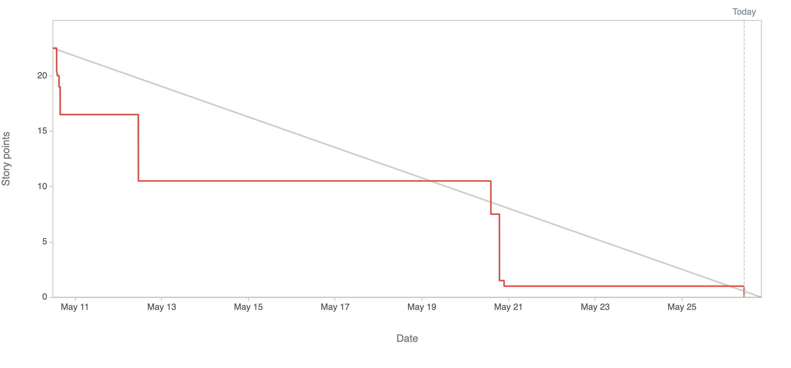

# 2.7.3 Sprint Review

## Review Sprint Ziele

| **Sprint Ziel**                 | **Status** |
| ------------------------------- | ---------- |
| Project Start                   | 100%       |
| Create RISK Board               | 100%       |
| Projectmanagement Documentation | 100%       |
| Create Service Design           | 100%       |
| Define Cloud Provider           | 100%       |
| Define Storage Mechanism        | 100%       |

## Status Project Board

| **Total Tickets** | **Abgeschlossene Tickets** | **Nicht abgeschlossene Tickets** | **Prozentsatz** |
| :---------------: | -------------------------- | -------------------------------- | --------------- |
|        20         | 20                         | 0                                | 100%            |

| **Total Storypoints** | **Abgeschlossene Storypoints** | **Nicht abgeschlossene Storypoints** | **Prozentsatz** |
| :-------------------: | ------------------------------ | ------------------------------------ | --------------- |
|         21.5          | 21.5                           | 0                                    | 100%            |

## Anpassungen am Projekt?

Es werden keine Anpassungen am Projekt vorgenommen.

## Notizen / Anmerkungen

Der Sprint 01 war sehr erfolgreich, da alle Sprintziele zu 100% erreicht wurden. Diese Ziele umfassten den Projektstart, die Erstellung eines RISK Boards, die Dokumentation des Projektmanagements, die Erstellung eines Service Designs, die Definition des Cloud-Anbieters und die Definition des Speichermechanismus.

Das Projektboard zeigt, dass alle 20 Tickets und 21.5 Storypoints abgeschlossen wurden, was ebenfalls einer Erfolgsrate von 100% entspricht.

Somit gab es keine Left- und Spill-overs. Da für diesen Sprint mehr Arbeitszeit zur Verfügung stand als ursprünglich geplant, konnten wir bereits einige Aufgaben für den nächsten Sprint in Angriff nehmen. Insbesondere haben wir mit der Entwicklung der Backend-API begonnen.

---

- [GIT Repository Tag - Sprint01](https://github.com/Cloud-native-engineering/sem03_docs/releases/tag/sprint-01)
- [Jira Board](https://itcne23.atlassian.net/jira/software/projects/BPM/boards/3)
- [Jira Sprint Tickets](https://itcne23.atlassian.net/issues/?jql=project+%3D+%22URL%22+AND+sprint+%3D+6+ORDER+BY+created+DESC&atlOrigin=eyJpIjoiYWE5M2EwY2Y1ZjA0NGE2NTllMzU5MDNhNGY2Yjk4NDUiLCJwIjoiaiJ9)
- [Jira Epics](https://itcne23.atlassian.net/issues/?jql=project+%3D+%22URL%22+AND+type+%3D+Epic+ORDER+BY+created+DESC&atlOrigin=eyJpIjoiNDA0Yjg3ODEzYjAwNDY3ZmEyMzUxZmNjNmQzNGM1YWQiLCJwIjoiaiJ9)
- [Jira Backlog](https://itcne23.atlassian.net/jira/software/projects/URL/boards/3/backlog)
