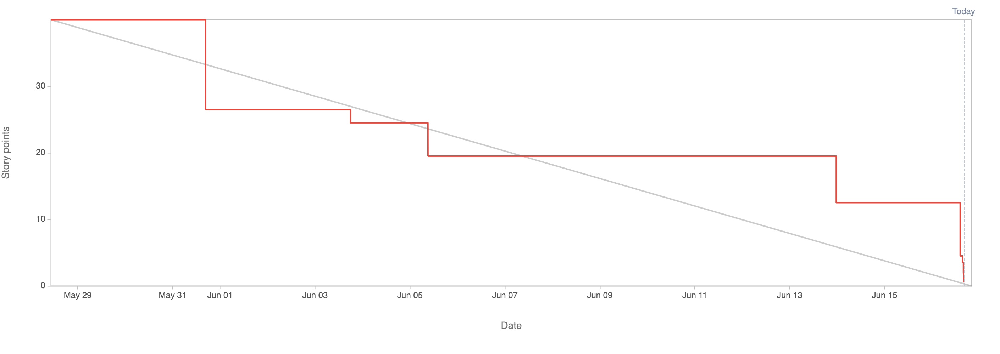

# 2.8.3 Sprint Review

## Review Sprint Ziele

| **Sprint Ziel**             | **Status** |
| --------------------------- | ---------- |
| Deploy Cloud Infrastructure | 100%       |
| MVP - BackendAPI            | 100%       |
| MVP - Redirector            | 100%       |
| MVP - Datahandler           | 100%       |
| MVP - SPA                   | 95%        |
| Add Input from SME          | 100%       |

## Status Project Board

| **Total Tickets** | **Abgeschlossene Tickets** | **Nicht abgeschlossene Tickets** | **Prozentsatz** |
| :---------------: | -------------------------- | -------------------------------- | --------------- |
|        22         | 21                         | 1                                | 95.5%           |

| **Total Storypoints** | **Abgeschlossene Storypoints** | **Nicht abgeschlossene Storypoints** | **Prozentsatz** |
| :-------------------: | ------------------------------ | ------------------------------------ | --------------- |
|          40           | 39.5                           | 0.5                                  | 98.75%          |

## Anpassungen am Projekt?

Es werden keine Anpassungen am Projekt vorgenommen.

## Notizen / Anmerkungen

Sprint 02 war äusserst erfolgreich, da fast alle Tickets abgeschlossen werden konnten. Obwohl es im Vergleich zum vorherigen Sprint weniger Tickets gab, umfasste Sprint 2 eine grössere Anzahl an Story-Punkten. Dieser Sprint war technisch anspruchsvoll und ermöglichte die Fertigstellung des MVP für den MyURL-Service.

Die Arbeiten begannen mit der Backend-API, in die viel Zeit investiert wurde, da sie die technisch komplexeste Komponente darstellt und die gesamte Logik des MyURL-Services abbilden muss. Anschliessend wurde der Redirector und Datahandler implementiert, der in kurzer Zeit und hoher Qualität umgesetzt werden konnte.

Die grösste Herausforderung stellte die Arbeit an der Single-Page-Application (SPA) dar, mit der das Agile-Team bis zu diesem Zeitpunkt noch keine Erfahrung hatte. Trotzdem konnte diese Aufgabe erfolgreich bewältigt werden.

Es gab nur ein Left- und Spill-over: Die SPA konnte noch nicht veröffentlicht werden. Dies lag hauptsächlich daran, dass ein Artefakt erst während des Builds in die Code-Basis eingefügt werden sollte. Daher war der Story-Point mit 0.5 nicht optimal geschätzt. Nach Absprache im Projektteam wurde jedoch festgestellt, dass dieser Spill-over nicht kritisch ist und im nächsten Sprint abgeschlossen wird.

---

- [GIT Repository Tag - Sprint02](https://github.com/Cloud-native-engineering/sem03_docs/releases/tag/sprint-02)
- [Jira Board](https://itcne23.atlassian.net/jira/software/projects/BPM/boards/3)
- [Jira Sprint Tickets](https://itcne23.atlassian.net/issues/?jql=project+%3D+%22URL%22+AND+sprint+%3D+7+ORDER+BY+created+DESC&atlOrigin=eyJpIjoiZDI3MmM2OWEzMGU3NDBiYjgwNjUzNTAwNWExNGYzYzAiLCJwIjoiaiJ9)
- [Jira Epics](https://itcne23.atlassian.net/issues/URL-57?atlOrigin=eyJpIjoiZDI3MmM2OWEzMGU3NDBiYjgwNjUzNTAwNWExNGYzYzAiLCJwIjoiaiJ9&jql=project%20%3D%20%22URL%22%20AND%20type%20%3D%20Epic%20ORDER%20BY%20created%20DESC)
- [Jira Backlog](https://itcne23.atlassian.net/jira/software/projects/URL/boards/3/backlog)
