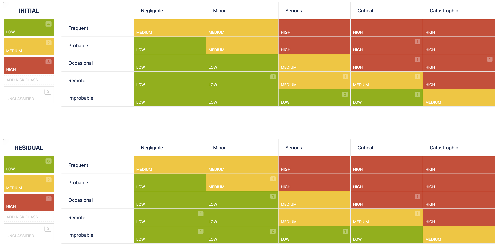

# 2.7.5 Riskboard Meeting

Im Riskboard Meeting wird über die aktuellen Risiken des Projekts. Betrachtet werden die anfänglichen Auswirkungen und Wahrscheinlichkeiten dieser Risiken und gefolgt von einer gründlichen Diskussion. Anschliessend schätzen die Teilnehmer des Riskboards das Risiko ein und planen entsprechende Gegenmassnahmen.

| **Total Risks** | **Low Risks** | **Medium Risks** | **High Risks** |
| :-------------: | ------------- | ---------------- | -------------- |
|        9        | 4             | 2                | 3              |

- [Risiko Tabelle](https://itcne23.atlassian.net/projects/URL?selectedItem=com-softcomply-riskmanager-cloud__risk-table-link&ac.filter=)

## Neu Risiken

Da dies das erste Riskmeeting ist, wurden alle Risiken als neu betrachtet. Besonderes Augenmerk lag auf den Risiken mit der initialen Risikostufe "hoch".

- keine

## Update zu Risiken

- Cloud-Kosten:
  - Ein weiteres AWS-Learner-Lab wurde bei einem Fachexperten angefragt, da die Kosten aufgrund von Debugging-Aktivitäten während des Deployments gestiegen sind. Diese Kosten bleiben jedoch innerhalb des Projektbudgets. Da das Budget für die Cloud-Infrastruktur auf 100$ pro Monat festgelegt wurde, ist es verständlich, dass die LAB-Credits langsam zur Neige gehen, da das Projekt bereits über einen Monat läuft.
  