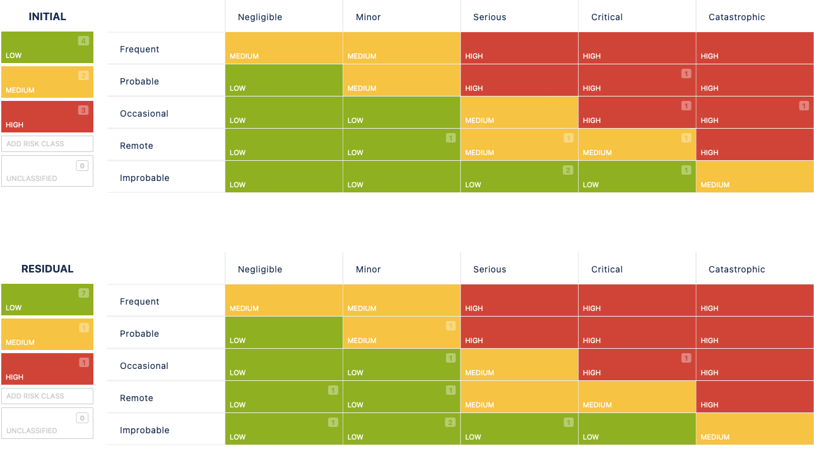

# 2.9.5 Riskboard Meeting

Im Riskboard Meeting wird über die aktuellen Risiken des Projekts. Betrachtet werden die anfänglichen Auswirkungen und Wahrscheinlichkeiten dieser Risiken und gefolgt von einer gründlichen Diskussion. Anschliessend schätzen die Teilnehmer des Riskboards das Risiko ein und planen entsprechende Gegenmassnahmen.

| **Total Risks** | **Low Risks** | **Medium Risks** | **High Risks** |
| :-------------: | ------------- | ---------------- | -------------- |
|        6        | 6             | 0                | 0              |

- [Risiko Tabelle](https://itcne23.atlassian.net/projects/URL?selectedItem=com-softcomply-riskmanager-cloud__risk-table-link&ac.filter=)

## Neu Risiken

Da dies das erste Riskmeeting ist, wurden alle Risiken als neu betrachtet. Besonderes Augenmerk lag auf den Risiken mit der initialen Risikostufe "hoch".

- keine

## Update zu Risiken

- Cloud-Kosten:
  - Es musste ins neue Learner Lab gezügelt werden. Dadurch, dass aber die meisten Schritte automatisiert waren, war die Umstellung sehr rasch vorbei.
  - Durch die fortschrittliche Automatisierung konnte das Risiko auf Low herabgestuft werden.
- SPA Komplexität
  - Risiko konnte erfolgreich geschlossen werden. Es wurde als Status "Fixed" markiert. Die SPA konnte erfolgreich in die Arbeit integriert werden.
- Not enough time for implementation
  - Risiko Abgeschlossen und behoben (Fixed)
  - Die Zeitplanung wurde sehr gut eingehalten
- AWS Learner Lab Restrictions
  - Abgeschlossen / Fixed
  - Die gesamte Arbeit konnte im AWS-Academy Lab erstellt werden.
  