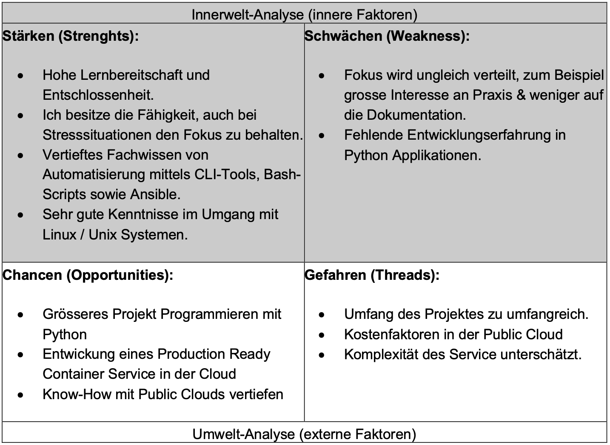

# 2.3 SWOT Analyse

Mit einer SWOT-Analyse ist ersichtlich, was die Einflussfaktoren auf ein Projekt sind. Es ermöglicht dem Projekt, ihre Positionierung und Strategie zu verstehen, um ihre Stärken zu nutzen, Schwächen zu verbessern und um Changchun und Risiken zu erkennen.

### Risikominimierung

Um einem Misserfolg zu vermindern, werden gezielt Massnahmen ergriffen, um die
Eintrittswahrscheinlichkeit möglichst tief zu halten.

- Projektplanung
  - Schätzen der Tasks (Priorität & Aufwand).
  - Nach einem Sprint wird reflektiert. Falls offene Tasks noch vorhanden sind, wird deren Ursache analysiert.
- Zeitmanagement
  - Regelmässiges Refinement von Tasks und Backlog.
  - Zeitliche Unterstützung vom Arbeitgeber, falls notwendig.
- Technische Schwierigkeiten
  - Bei Limits der Camunda Version wird auf der neue, bzw. der alte Major Release verwendet.
