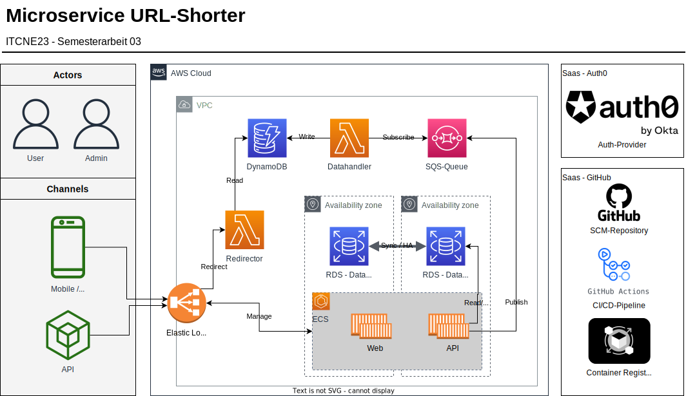
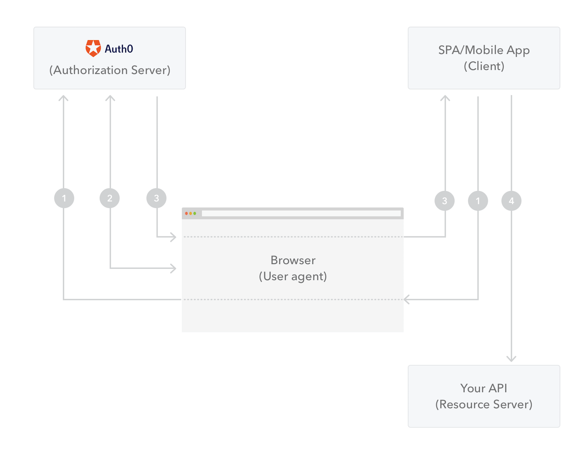

# 3.5 Architektur und Technologie

In der Semesterarbeit kommen eine Vielzahl von Tools und Technologien zum Einsatz.

## Cloud Services

- ECS
- LAMBDA
- SQS
- RDS Database
- Loadbalancer
- API-Gateway
- DynamoDB

## Technologien

- Git (GitHub)
- CI/CD (GitHub Actions)
- IDP (Auth0)
- Python
- Flask / Django
- Vue /React / Typescript

## Data Flows

Datenflussdiagramme bieten einen umfassenden Überblick über die Interaktionen zwischen den verschiedenen Akteuren in einem System. Im folgenden Abschnitt werden die wichtigsten Datenflüsse detailliert erläutert:

### Login / Authentifizierung

1. Der Benutzer öffnet den Browser und greift auf die Single Page App (SPA) zu.
2. Die SPA initiiert den Authentifizierungsfluss und leitet den Browser zu Auth0 um, genauer gesagt zum /authorize Endpunkt, damit sich der Benutzer authentifizieren kann.
3. Auth0 authentifiziert den Benutzer.
4. Auth0 leitet den Benutzer mit einem Access Token (und optional einem ID Token) im Hash-Fragment der URI zur SPA zurück. Die SPA kann nun die Tokens aus dem Hash-Fragment extrahieren.
5. Der Benutzer wird zur SPA zurückgeleitet, diesmal mit dem Access Token.
6. Die SPA verwendet das Access Token, um im Namen des Benutzers auf die Backend-API zuzugreifen.
7. Die Backend-API erhält die Anforderung und das Access Token. Sie sendet das Access Token an Auth0 zur Validierung.
8. Wenn das Token gültig ist, gewährt die Backend-API der SPA Zugriff auf die angeforderten Ressourcen. Wenn das Token ungültig ist, sendet die Backend-API eine Fehlermeldung "Unauthorized" an die SPA.
9. Die SPA erhält die Antwort von der Backend-API und zeigt dem Benutzer die angeforderten Daten oder Inhalte an.

Die Kommunikation sollte so interpretiert werden, dass der Browser als Vermittler fungiert. Alle Umleitungen erfolgen stets über den Browser, wie im folgenden Bild dargestellt.

<small>Abbildung - Quelle Auth0</small>

1. Die SPA startet die Authentifizierung und leitet den Benutzer zu Auth0 weiter
2. Auth0 fordert den Benutzer zum Anmelden auf und gibt einen Access-Token zurück.
3. Auth0 leitet den Benutzer zurück zum SPA-App
4. Die SPA kann ab nun mit dem Token auf das Backend-API zugreifen und die Daten verarbeiten und visualisieren.

### Redirect

Der Redirect-Fluss beginnt, wenn ein Benutzer eine kurze URL in seinen Browser eingibt.

1. **Zugriff auf den API-Gateway:**
   - Der Browser greift auf die Shortcode-URL (domain.ch/\<code>\) zu und sendet eine Anfrage an den API-Gateway.

2. **Auslösen der Lambda-Funktion:**
   - Der API-Gateway triggert eine Lambda-Funktion, um die Anfrage zu verarbeiten.

3. **Nachschlagen der URL in der Keyvalue-Datenbank:**
   - Die Lambda-Funktion führt ein Lookup der URL in der Keyvalue-Datenbank durch.

4. **Rückgabe der URL-Daten:**
   - Die Keyvalue-Datenbank gibt die URL-Daten an die Lambda-Funktion zurück.

5. **Überprüfung der URL:**
   - Die Lambda-Funktion überprüft, ob die URL verifiziert ist.

6. **Verifiziert:**
   - Falls die URL verifiziert ist, führt die Lambda-Funktion einen Redirect zur Ziel-URL durch.

7. **Nicht verifiziert:**
   - Falls die URL nicht verifiziert ist, zeigt die Lambda-Funktion eine Info-Seite an.

### Short URL Management

Der Short URL Management-Fluss beginnt, wenn ein Benutzer eine neue kurze URL über das API-Gateway erstellt. Der Antrag wird an eine Lambda-Funktion gesendet, die eine neue kurze URL in der DynamoDB-Datenbank erstellt und die Details an den Benutzer zurückgibt.

1. **Anmeldung des Benutzers:**
   - Der Benutzer meldet sich im Browser bei der Single Page App (SPA) an.
   - Die SPA leitet den Authentifizierungsprozess an Auth0 weiter.
   - Auth0 authentifiziert den Benutzer und gibt ein Token zurück an die SPA.

2. **Erstellen der gekürzten URL:**
   - Der Benutzer erstellt eine neue gekürzte URL in der SPA.
   - Die SPA sendet die neue URL an das Backend-API.

3. **Speichern und Weiterleiten der URL:**
   - Das Backend-API speichert die URL in der Datenbank (db).
   - Zusätzlich stellt das Backend-API die URL in die Message Queue.

4. **Verarbeitung der Nachricht:**
   - Die Message Queue übergibt die Nachricht an eine Lambda-Funktion.
   - Die Lambda-Funktion verarbeitet die Nachricht und schreibt die Daten in die Keyvalue-Datenbank (Keyvalue-DB).
