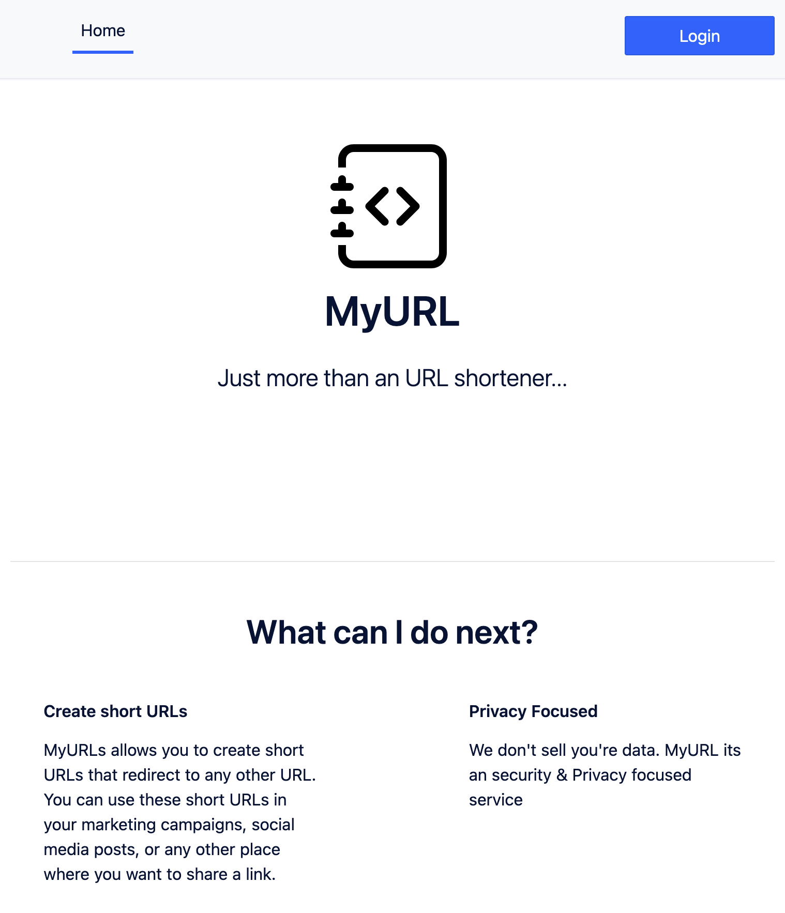
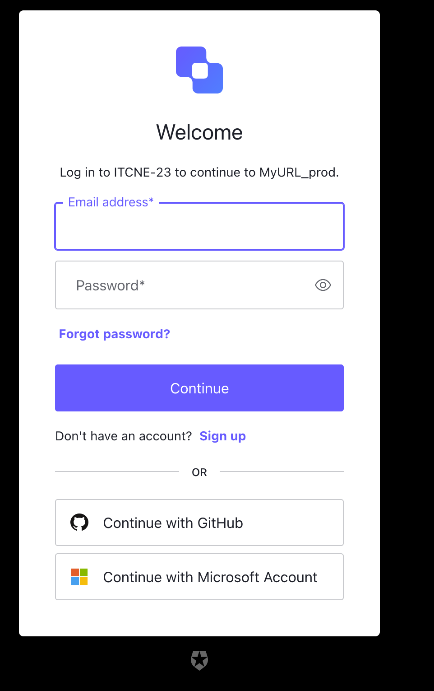
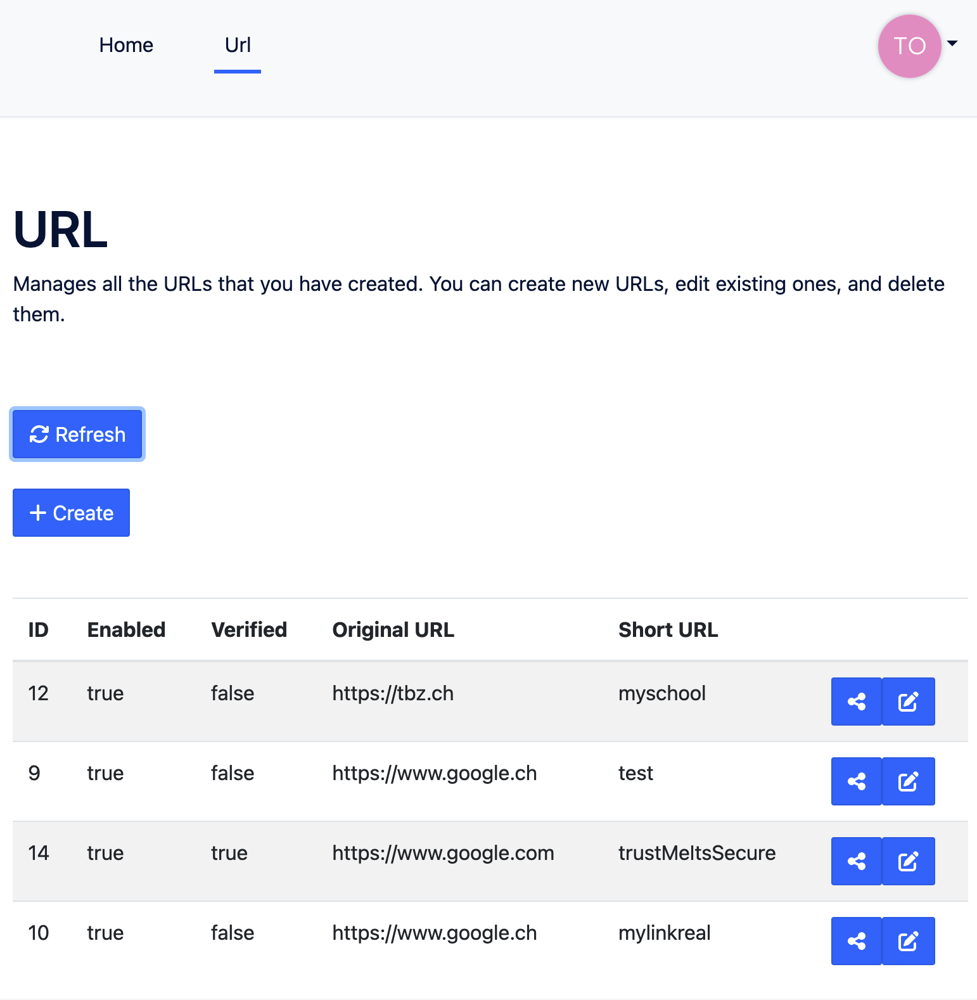
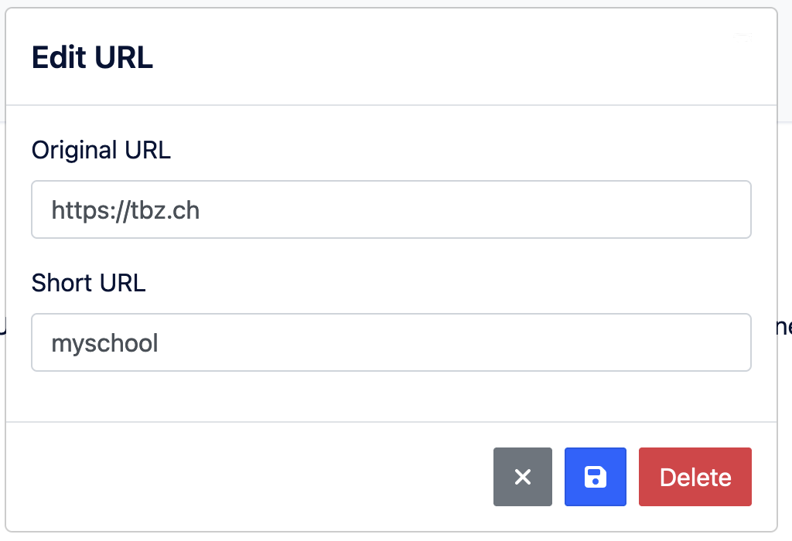
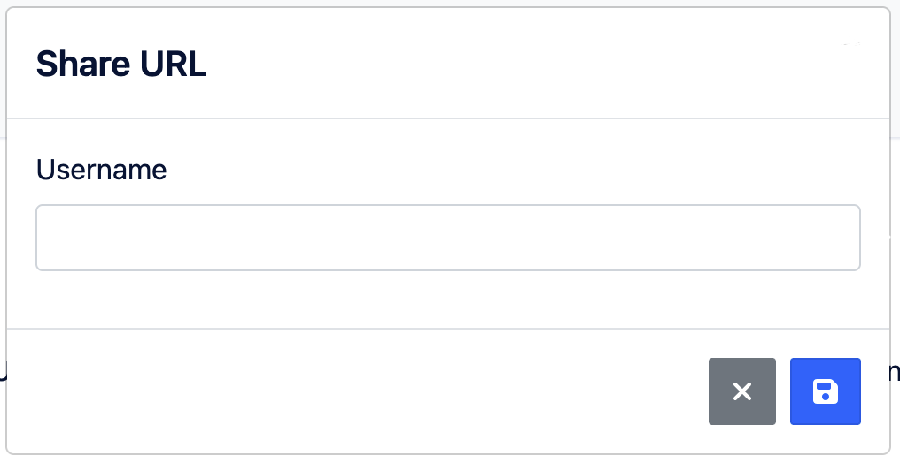

# 4.4 Single Page Application

Die Single Page Application auch SPA genannt ist das Web-Interface für den URL-Shorter. Es ermöglicht User sich für den Service zu registrieren und Ihre URLs zu verwalten.

## Features

- **URL-Teilen**: URLs können problemlos geteilt werden
- **Sicherheit**: Der Service gewährleistet hohe Verfügbarkeit. Für die Identitätsverwaltung wird AUTH0 genutzt.
- **Verwaltung**: URLs können einfach bearbeitet werden
- **Microservice**: Der SPA ist so konzipiert, dass er keinen eigenen Zustand und Persistenz hat. Er bezieht alle seine Daten von der Backend-API
- **Skalierbarkeit**: Der SPA ist so konzipiert, dass er leicht skaliert werden kann. Zur Skalierung kann einfach eine weitere Instanz im ECS-Cluster gestartet werden, die hinter einem Loadbalancer erreichbar ist.

## UI/UX Design

Die SPA wurde mit dem Ziel entworfen, ein optimales Benutzererlebnis zu gewährleisten. Um die Benutzeroberfläche zu betrachten, kann entweder den Service kostenlos benutzt oder die folgenden Abschnitte betrachet werden.

    
SPA Home

    

    
SPA Login

    

    
SPA Manage URL

    
    
    

## How to Deploy

Der Prozess für das initial Deployment ist im Git-Repo beschrieben. Es müssen ein paar spezifische ENV-Variablen gesetzt werden, um den Service zu konfigurieren.

Für ein Update des Services ist die Erstellung eines neuen Container-Images erforderlich. Dies kann erreicht werden, indem ein Versions-Tag auf dem Main-Branch des Git-Repositorys gesetzt wird. Anschliessend wird die CI/CD-Pipeline automatisch eine neue Version erstellen und diese in den GitHub Packages veröffentlichen.

Der letzte Schritt im Update-Prozess ist die Durchführung eines Blue/Green Deployments auf dem ECS-Cluster. Während dieses Deployments wird der Cluster zunächst die neue Version starten und anschliessend das Backend des Load Balancers umschalten. Dieser Prozess gewährleistet eine nahtlose Aktualisierung des Services mit minimaler/keiner Ausfallzeit.

## Sourcecode

Der Quellcode für die SPA ist öffentlich zugänglich und wird unter der [MIT-Lizenz](https://github.com/Cloud-native-engineering/myurl_redirector/blob/main/LICENSE) bereitgestellt. Diese Lizenz ermöglicht eine breite Nutzung und Anpassung des Codes.

- [GitHub - Sourcecode](https://github.com/Cloud-native-engineering/myurl_app)
