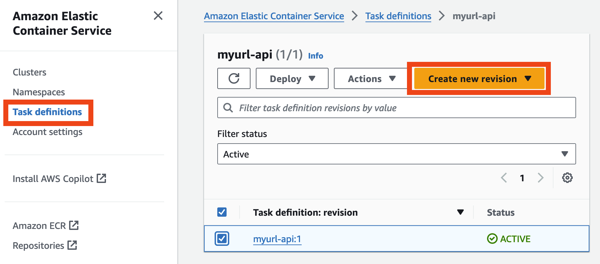
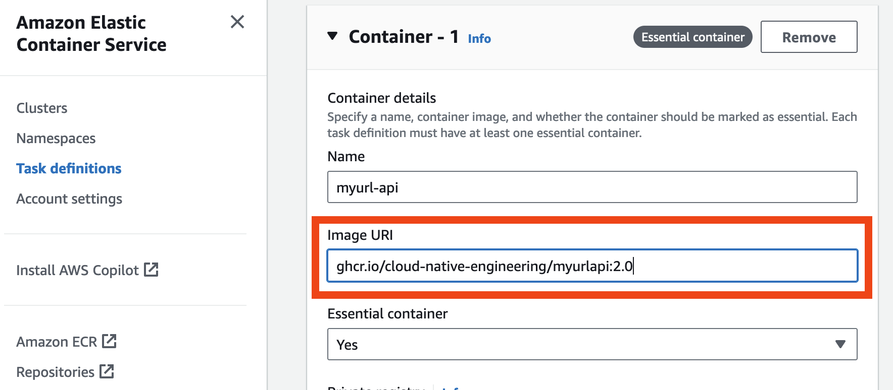
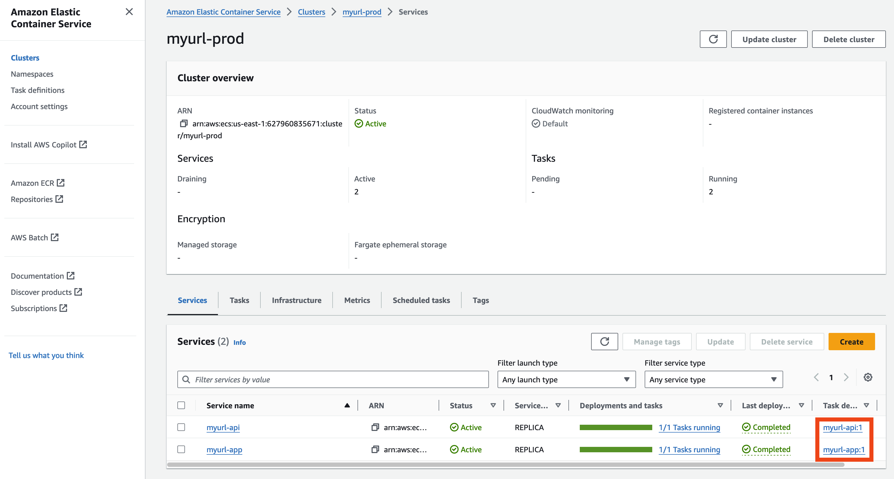
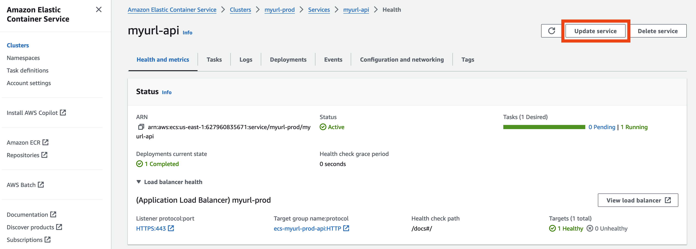

# 6.2 Version Upgrade

Um eine neue Version zu deployen, ist es erforderlich, über die GitHub-Actions Pipeline ein neues Container-Image zu erstellen. Dabei ist der definierte Prozess mit Branch-Protections zu beachten. Nach erfolgreichem Durchlauf der Pipeline wird automatisch ein neues Image-Tag erstellt. Dieses Tag muss anschließend im Task-Template aktualisiert und zum Abschluss deployed werden.

Folgende Schritte sind dazu notwendig:

1. Update des Sourcecode mit Merge-Request in den main-Branch
2. Update des Task-Templates
   1. 
   2. 
3. Deploy Changes auf dem ECS-Cluster
   1. 
   1. 
4. Warten und zuschauen, wie zuerst ein neuer Container gestartet wird und nach und nach das Loadbalancer Backend gewechselt wird.
