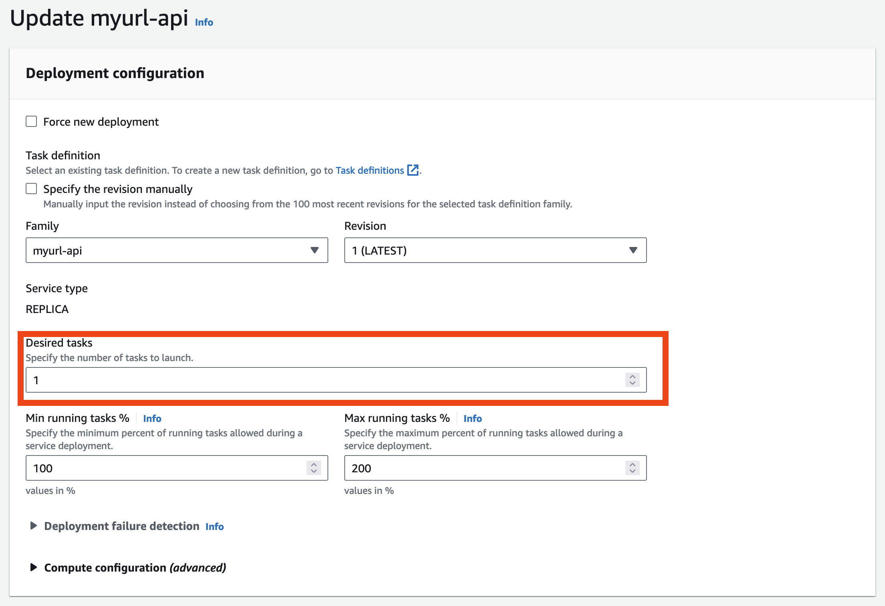
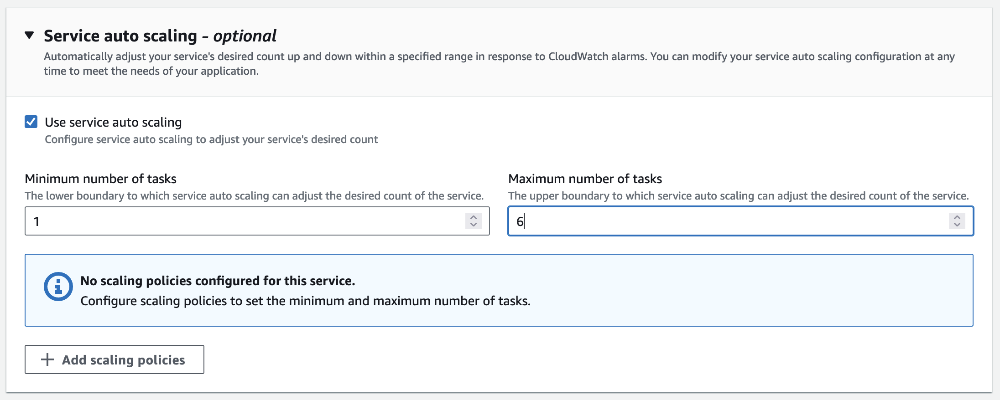

# 6.3 Skalierung

Um das volle Potenzial von Microservices auszuschöpfen, ist eine angemessene Skalierung unerlässlich. Es gibt verschiedene Strategien, die für die Skalierung angewendet werden können.

## Manuelle Skalierung

Die manuelle Skalierung ermöglicht es, die Anzahl der gewünschten Tasks durch Setzen des "Desired task"-Wertes anzupassen. Diese Einstellung wird im ECS-Cluster vorgenommen. Für eine optimale Verfügbarkeit wird empfohlen, mindestens zwei Desired Tasks zu konfigurieren. ECS verteilt diese Container dann automatisch über verschiedene Verfügbarkeitszonen und integriert sie in das Backend des Load Balancers.

## Automatische Skalierung

Die automatische Skalierung bietet den Vorteil, dass die Applikation stets über ausreichend Ressourcen verfügt, um den Anforderungen der Nutzer gerecht zu werden. Sollte ein Engpass auftreten, deployt ECS automatisch weitere Container und bindet sie in den Load Balancer ein.

