# 6. Integrationstests

Um sicherzustellen, dass sämtliche Microservice zusammen funktionieren werden Integrationstest durchgeführt. Diese Test werden als Manuelle Tests ausgeführt. In der Zukunft werden diese Testcases automatisiert und wir automatisiert getestet. Ziel dieser Tests war es, die technische Funktionsfähigkeit des Businessprozess zu bestätigen und zu demonstrieren, dass die festgelegten Ziele erreicht wurden. Im Rahmen dieser Tests wurden folgende Funktionalitäten überprüft:

- Redirect
  - Secure (verified redirect)
  - safe redirect (redirect over info-page)
- Login und Authentifizierung
- SPA
  - Login
  - Registration
  - Logout
- MyURL
  - Create Short-URL
  - Manage Short-URL
  - Delete Short-URL
  - Share Short-URL

In dieser Testreihe werden die grundlegenden Funktionalitäten von Services, die als Software-as-a-Service (SaaS) bezogen werden, nicht berücksichtigt. Dazu gehören insbesondere die Amazon Web Services (AWS). Ausserdem sind grundlegende Komponenten wie die Internetverbindung von den Tests ausgenommen.

## Test-001 - User Registration

| Testfall-001 | User Registration |
|:--| :-- |
| Ziel: | Ein User kann sich für den MyURL-Service registrieren |
| Beschreibung: | Mit dem Webbrowser auf den MyURL-Service zugreifen und die Login Seite öffnen. Danach auf den Registrieren Button klicken und ein Test-Benutzer anlegen. |
| Soll-Wert: | Der User kann auf MyURL zugreifen und ein neuer User-Registrieren. |
| Ist-Wert: | Der User kann sich erfolgreich registrieren   

Image
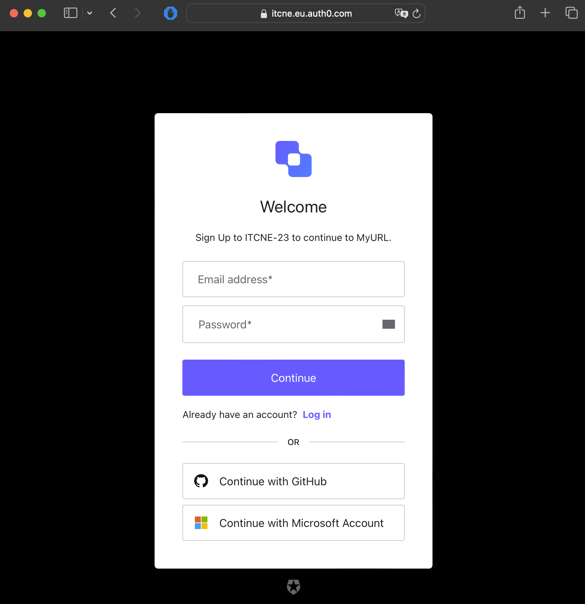
 |

## Test-002 - User Login

| Testfall-002 | User Login |
|:--| :-- |
| Ziel: | Ein User kann sich erfolgreich am MyURL-Service anmelden. |
| Beschreibung: | Mit dem Webbrowser auf den MyURL-Service zugreifen und die Login Seite öffnen. Danach soll das Login abgeschlossen werden. |
| Soll-Wert: | Ein User kann sich erfolgreich beim MyURL-Service anmelden. |
| Ist-Wert: | Der frisch registrierte Benutzer konnte sich erfolgreich anmelden.   

Image
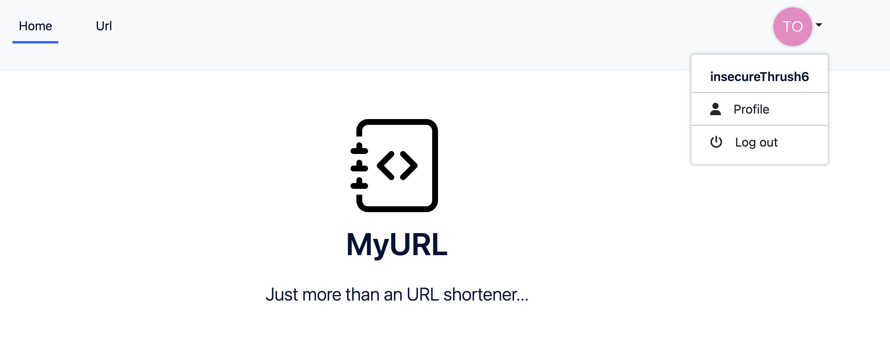
 |

## Test-003 - User Logout

| Testfall-003 | User Logout |
|:--| :-- |
| Ziel: | Ein User kann sich vom MyURL-Service erfolgreich abmelden und seine Session schliessen. |
| Beschreibung: | Mit dem bereits angemeldeten User auf den Logout-Button klicken und ein Logout ausführen. Der User sollte erfolgreich abgemeldet werden. |
| Soll-Wert: | Der Benutzer kann sich abmelden uns seine Session erfolgreich schliessen. |
| Ist-Wert: | Die Session konnte erfolgreich geschlossen werden. Nach dem Drücken auf abmelden wird auf die Login-Seite weitergeleitet:   

Image
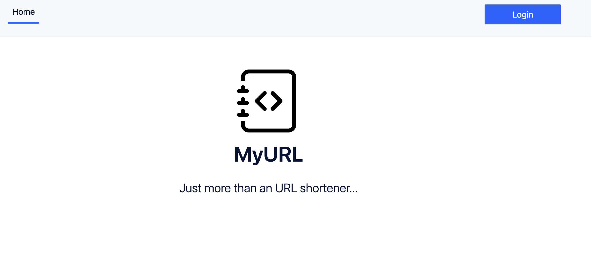
 |

## Test-004 - Create Short URL

| Testfall-004 | Create Short URL |
|:--| :-- |
| Ziel: | Eine Short-URL kann erstellt werden. |
| Beschreibung: | Mit dem Webbrowser auf den MyURL-Service zugreifen und sich mit einem Benutzer anmelden. Danach soll auf den URL-Register zugegriffen werden und eine URL erstellt werden. |
| Soll-Wert: | Die kürzlich erstellte Short-URL soll in der Liste auftauchen und ersichtlich sein. |
| Ist-Wert: | Es konnte erfolgreich eine neue URL erstellt werden.   

Image
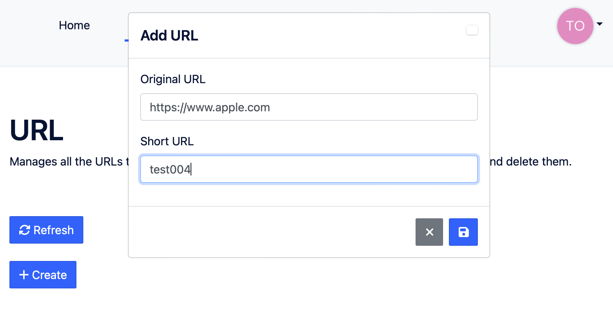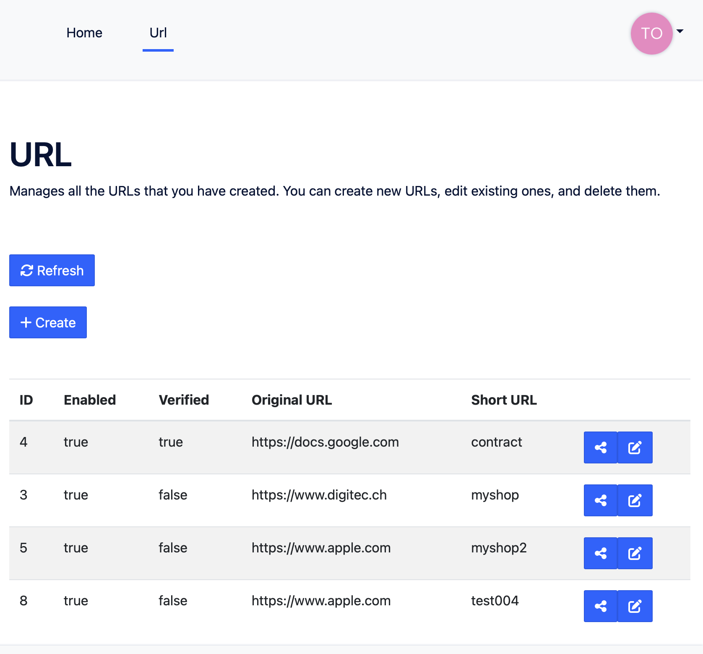
 |

## Test-005 - Create verified Short URL

| Testfall-005 | Create verified Short URL |
|:--| :-- |
| Ziel: | Es kann eine verified Short URL erstellt werden. |
| Beschreibung: | Es soll versucht werden einen URL-Short für folgende URL erstellt werden: "https://docs.google.com" der short-code kann frei gewählt werden. |
| Soll-Wert: | Die erstellte Short-URL ist in der Liste sichtbar und der verified Flag ist gesetzt. |
| Ist-Wert: | Es konnte erfolgreich eine neue URL erstellt werden.   

Image
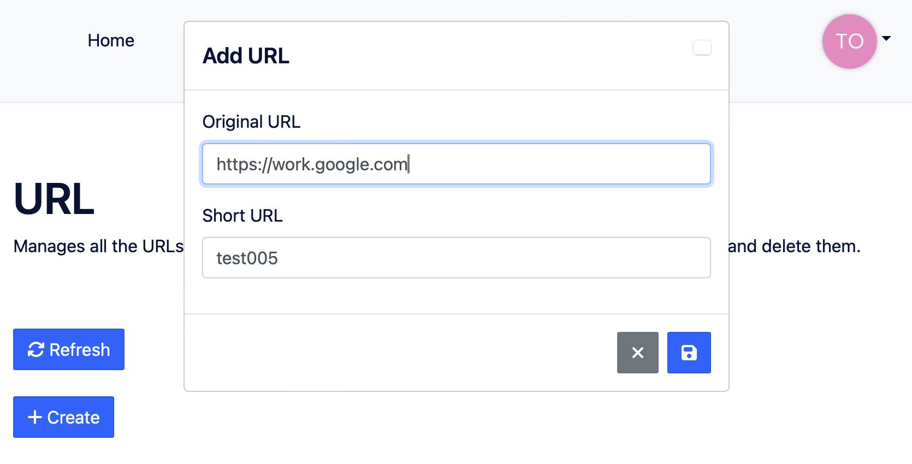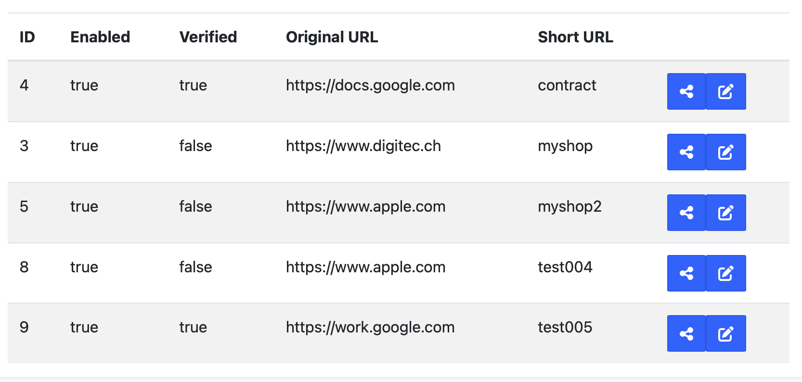
 |

## Test-006 - Safe Redirect

| Testfall-006 | Safe Redirect |
|:--| :-- |
| Ziel: | Bei einer nicht verifizierten Domain wird eine Info-Page gezeigt und der User kann mit Hilfe einem Button den Redirect fortführen. |
| Beschreibung: | Es soll mit dem Webbrowser auf den oben erstellten (Testfall-004) Short-URL zugegriffen werden. |
| Soll-Wert: | Der Redirect ist erst nach Bestätigung mit Hilfe eines Buttons möglich. |
| Ist-Wert: | Der Benutzer wird zuerst auf eine Info-Seite weitergeleitet:   

Image
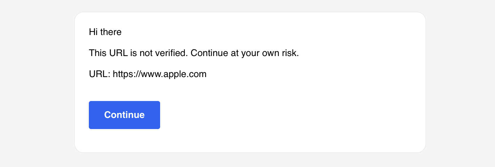
 |

## Test-007 - Direct Redirect

| Testfall-007 | Direct Redirect |
|:--| :-- |
| Ziel: | Direkte Redirects sind möglich |
| Beschreibung: | Bei einer verifizierten Domain wird der User direkt auf die Ziel-URL weitergeleitet. Dazu soll der Short-Code vom Testfall-005 verwendet werden. |
| Soll-Wert: | Der Benutzer wird direkt auf die Ziel-URL weitergeleitet. |
| Ist-Wert: | Der Benutzer wird ohne Info-Page auf die Ziel-URL weitergeleitet:   

Image
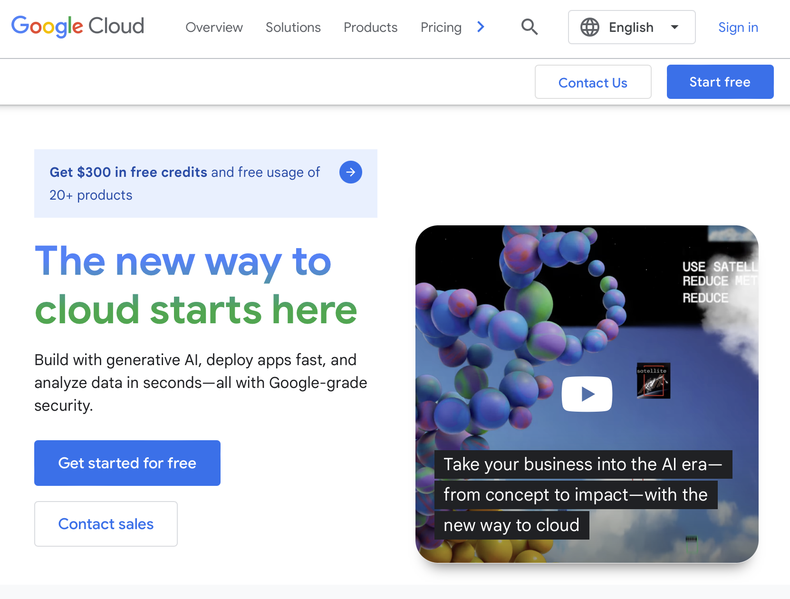
 |

## Test-008 - List URLs

| Testfall-008 | List URLs |
|:--| :-- |
| Ziel: | Sämtlich vom User verwalteten URLs sind im MyURL-Portal ersichtlich. |
| Beschreibung: | Ein angemeldeten User sieht seine URLs |
| Soll-Wert: | Es werden sämtliche URLs dem User angezeigt |
| Ist-Wert: | Es werden dem User eine Unzahl von URLs angezeigt, auf welche er berechtigt ist:   

Image
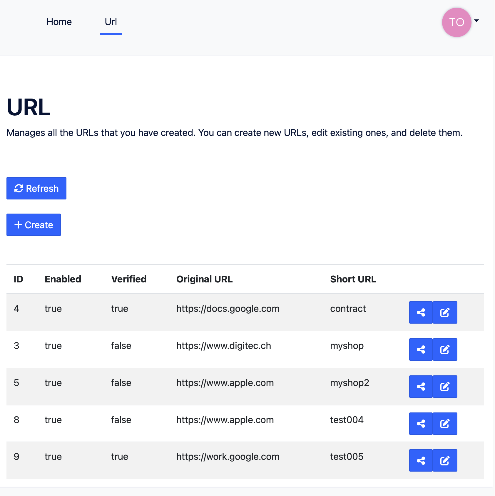
 |

## Test-009 - Delete URLs

| Testfall-009 | Delete URLs |
|:--| :-- |
| Ziel: | Löschen einer URL ist möglich. |
| Beschreibung: | Ein Angemeldeten User soll die URL-Editieren und danach den Lösch-button betätigen. Danach soll versucht werden auf den Short-URL zuzugreifen. |
| Soll-Wert: | Die URL kann gelöscht werden und verschwindet aus der Liste. Ein redirect auf diesen Short-Code ist auch nicht mehr möglich. |
| Ist-Wert: | Die URL konnte erfolgreich gelöscht werden:   

Image
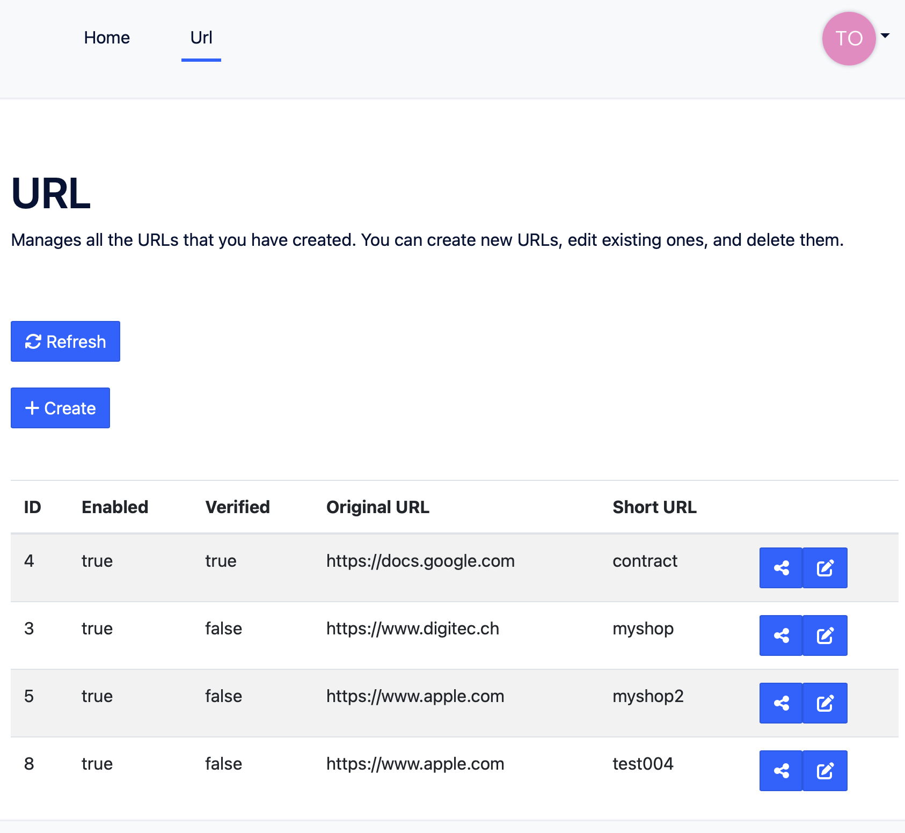
 |

## Test-010 - Share URL

| Testfall-010 | Share URL |
|:--| :-- |
| Ziel: | URLs können geteilt werden. |
| Beschreibung: | Ein angemeldeter User kann einem anderen User eine URL teilen. Dazu wird eine URL dem User 'shareTest' geteilt. Danach soll sich der User shareTest anmelden und im ist die URL sichtbar. |
| Soll-Wert: | Eine URL kann erfolgreich mit einem anderen User geteilt werden. |
| Ist-Wert: | Die URL konnte geteilt werden. dem User Share-test wird die URL angezeigt:   

Image
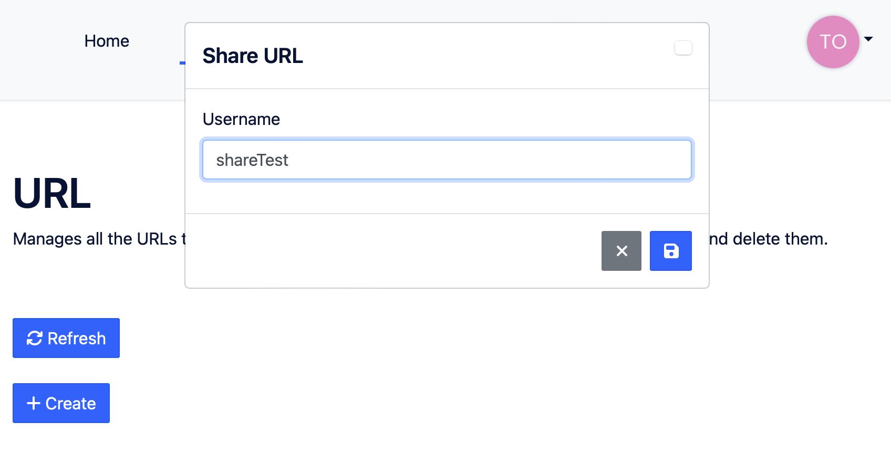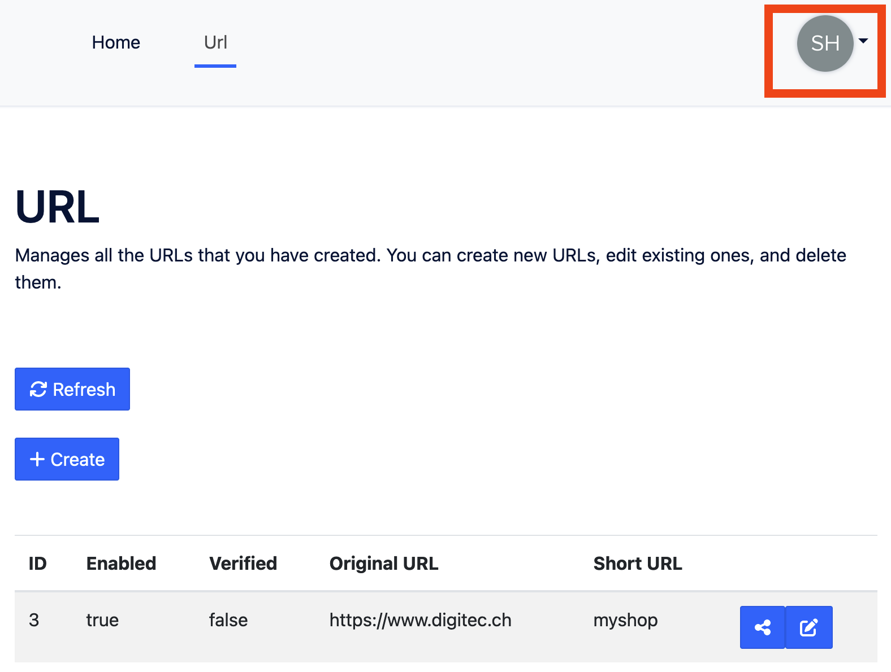 |

## Test-011 - Manage URL

| Testfall-011 | Manage URL |
|:--| :-- |
| Ziel: | URLs können editiert werden. |
| Beschreibung: | Ein angemeldeter User kann eine URL editieren. Dazu muss der User angemeldet sein und mit dem Edit-Symbol eine Korrektur starten und abschliessen |
| Soll-Wert: | Die Korrektur ist nach dem Abschluss in der Liste sichtbar. |
| Ist-Wert: | Eine URL kann erfolgreich bearbeitet werden:   

Image
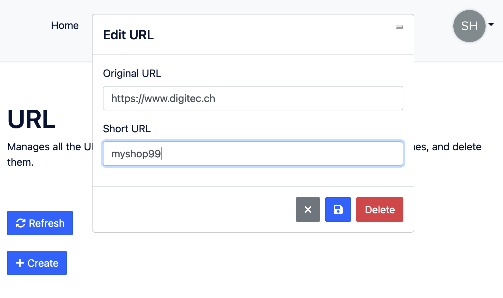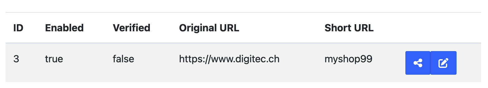 |

## Fazit

Die Testergebnisse bestätigen eindrucksvoll die Funktionsfähigkeit aller in dieser Arbeit implementierten Funktionalitäten. Sie zeigen, dass der MyURL-Service vollständig einsatzbereit und effektiv ist. Besonders hervorragend ist die einwandfreie und schnelle weiterleitung zu den Ziel-URLs.
